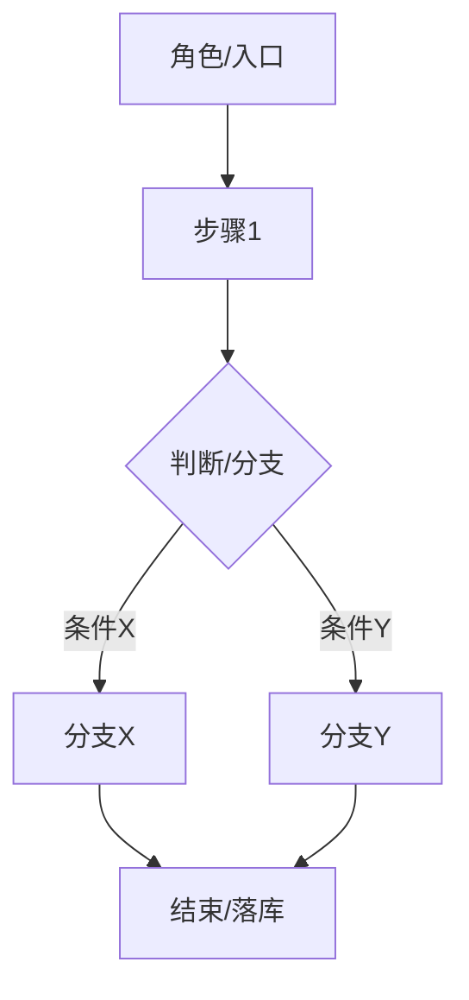
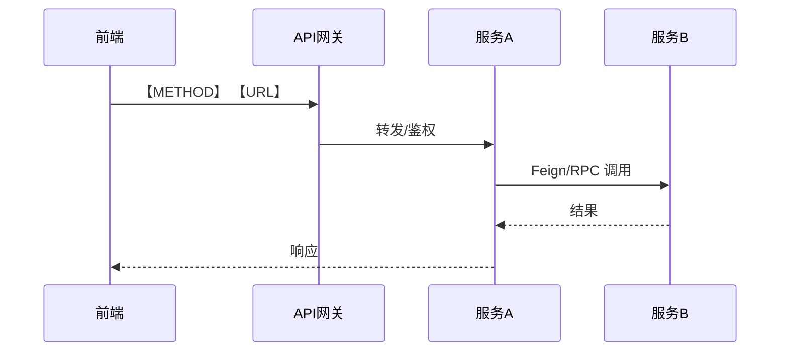
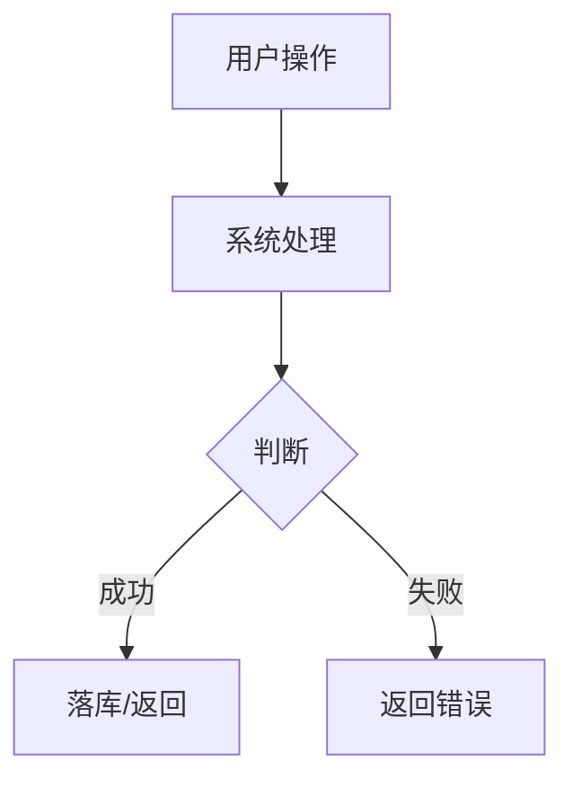
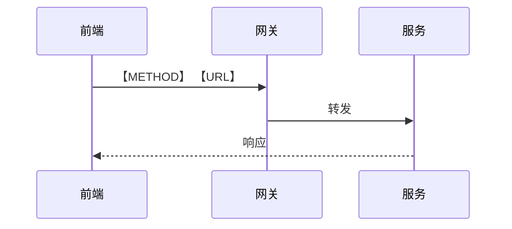

<title>【项目名】模块名</title>

# 【项目名】模块名

> 文档定位：本模块教程面向【目标读者】，覆盖【模块范围一句话】。
> 技术栈：【前端】/【后端】/【网关·中间件·数据库】。
> 骨架类型：【章节式（第X章）/ 日志式（dayXX）】——按项目性质二选一。

---

# ═══════════════════════════════════════════
# 模板 A：章节式（适用于体系化教程，如 WMS / 餐掌柜 / 秒杀 / AIGC）
# ═══════════════════════════════════════════

## 学习目标

读完本文你将掌握：

- 能够说出【模块】的业务流程与参与角色
- 能够梳理【模块】的前后端调用链路
- 能够设计【模块】的核心数据表并实现关键逻辑

---

## 第一章 【模块总览 / 熟悉项目】

### 1.1、业务需求

【用"角色 + 场景 + 规则 + 异常"描述：谁、在什么界面、做什么、边界与异常是什么。】

### 1.2、业务流程

下图展示【模块】的核心业务流程：



由上图可见，【一句话总结流程关键分支/落库点】。

---

## 第二章 【模块核心功能一】

### 2.1、业务需求

【同上，按需展开。】

### 2.2、实现分析

**前端请求分析**

- 入口页面 / 触发按钮：【……】
- 请求地址（经网关）：`【METHOD】 【URL】`
- 关键请求参数（JSON 示例）：

```json
{
  "fieldA": "值",
  "fieldB": 0
}
```

- 常见报错与排查：【如 500 → 某微服务未启动 / Feign 调用失败】

**阅读后端代码**

调用链：`【Controller#method】` → `【Service#method】` → `【Feign/Dao】`。
关键类方法：【列出核心类与方法，说明各自职责】。

**调用链路**

整个调用链路就是：前端 → 网关 → 【服务A】 → 【服务B】。



上图说明【服务职责划分 / 为什么这么串】。

### 2.3、数据表设计

【主表】表：【一句话说明用途。】

```sql
CREATE TABLE `t_xxx` (
  `id` bigint(20) NOT NULL AUTO_INCREMENT COMMENT '主键',
  `biz_field` varchar(64) NOT NULL COMMENT '业务字段说明',
  `status` tinyint(2) DEFAULT '1' COMMENT '状态：1-待处理，2-已完成',
  `create_time` datetime DEFAULT NULL COMMENT '创建时间',
  PRIMARY KEY (`id`),
  KEY `idx_status` (`status`)
) ENGINE=InnoDB DEFAULT CHARSET=utf8mb4 COMMENT='xxx表';
```

### 2.4、核心代码实现

```java
// 关键方法签名 + 核心逻辑（不必全文）
public Result<T> method(Param p) {
    // ...
}
```

### 2.5、总结 / 关键点

- 用到的设计模式：【责任链 / 策略 / 模板方法 …】
- 并发与一致性注意：【幂等、分布式事务、锁、超时重试 …】
- 易踩的坑：【……】

---

# ═══════════════════════════════════════════
# 模板 B：日志式（适用于按天/按课推进，如 物流 / 工作流 / 中州养老）
# ═══════════════════════════════════════════

# 【项目名】-day0X-【主题】

## 学习目标

- 了解【本节】的业务功能
- 掌握【本节】表/接口的设计
- 实现【本节】的业务逻辑

## 课程目标

通过前面的学习……希望能达成以下目标：

- 掌握需求分析和实现分析的方法
- 培养从 0 开发【微服务/模块】的能力

## 1、需求分析

### 1.1、整体流程

下图展示【主题】的整体业务流程：



### 1.2、业务规则

【角色 + 场景 + 规则 + 异常。】

## 2、实现分析

### 2.1、前端请求分析

- 入口页面 / 触发按钮：【……】
- 请求地址：`【METHOD】 【URL】`
- 关键参数（JSON 示例）：

```json
{ "fieldA": "值" }
```

### 2.2、阅读后端代码

调用链：`【Controller#method】` → `【Service#method】`。

### 2.3、调用链路



### 2.4、数据表设计

【主表】表 DDL 如下：

```sql
CREATE TABLE `t_xxx` (
  `id` bigint(20) NOT NULL AUTO_INCREMENT COMMENT '主键',
  `status` tinyint(2) DEFAULT '1' COMMENT '状态：1-待处理，2-完成',
  PRIMARY KEY (`id`)
) ENGINE=InnoDB DEFAULT CHARSET=utf8mb4 COMMENT='xxx表';
```

## 3、核心代码实现

```java
// 关键方法签名 + 核心逻辑
public Result<T> method(Param p) { /* ... */ }
```

## 4、总结

- 本节掌握：【……】
- 注意点：【……】

---

# 使用说明
- 章节式与日志式二选一，不要混用顶层编号。
- 每章/每天都遵循：学习目标 → 业务需求 → 实现分析（前端/后端/调用链）→ 数据表 → 核心代码 → 总结。
- 凡有图必有文字解说，凡有代码块必有引导句。
- 【梳理】模式不套此模板全文，只取流程/调用链图 + 接口清单表 + 数据模型概览，见 style-guide §7。
