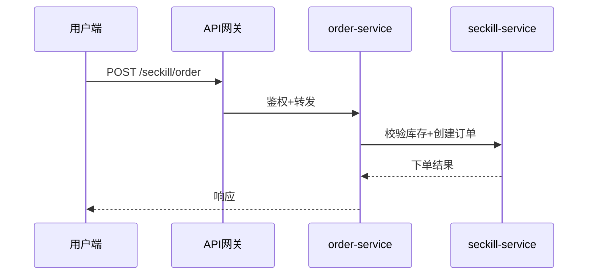

# 撰写风格指南（IT 业务模块教程）

本指南提炼自「智学伴侣」**全量语料**——9 大类模块、82 个 `.md` 文件、约 18.8 万行、9.3 MB，覆盖 WMS / 神领物流 / 餐掌柜 / 智牛股 / AIGC / 秒杀 / 工作流 / 中州养老 / 云岚到家。用于在【生成】模式下产出风格一致的模块文档。样本特征是"**业务驱动 + 实现落地**"：先讲清业务，再落到前后端实现，最后给出调用链路与代码。

---

## 0. 量化事实（来自全量扫描，作为风格决策依据）

- **代码语言以 Java 绝对主导**（1839 处），其次 JSON(417) / XML(194) / Plaintext(194) / Bash(188) / SQL(155) / YAML(134) / Shell(108) / TypeScript(68) / ProtoBuf(34) / Properties(24) / JavaScript(22)。前端涉及 TS/JS。
- **图表：mermaid 0 处，飞书截图链接 4677 个** → 本环境无图床，一律改用 mermaid；但原教程"**每段图都配文字解说**"的习惯必须保留（详见 §4）。
- SQL 建表 156 处，普遍带 `COMMENT` 与 `ENGINE=InnoDB`。
- 高频词（出现的文档数）：接口 59、Service 48、部署 46、前端 37、后端 36、Controller 34、业务流程 32、学习目标 27、流程图 26、Mapper 24、总结 18 → 说明标准套路高度稳定。
- **两种编号骨架并存**（见 §1），不是单一的顿号编号。

---

## 1. 两种文档骨架（先选骨架，再填内容）

全量扫描显示编号分两套，按项目性质选择：

### A. 章节式（"第 X 章 / 第一章 …"）
适用：WMS、餐掌柜、AIGC、秒杀、云岚到家、智牛股 等"体系化教程"。
- 顶层：`# 模块名` → `## 第一章 熟悉项目` / `## 第二章 入库管理` ……
- 章内递进：`### 1.1、业务需求` `### 1.2、实现分析`（顿号编号），更细可用 `#### 1.2.1 子项`。
- 紧凑变体：`## 1、业务背景` `### 1.1、业务需求`（数字+顿号，样本中同样大量存在）。**同一篇内编号风格必须统一**。

### B. 日志式（"dayXX-主题"）
适用：物流、工作流、中州养老 等"按天 / 按课推进"的实训笔记。
- 顶层：`# day03-运费微服务` → `## 学习目标` `## 课程目标` `## 1、需求分析` `## 2、实现` ……
- 特点：每篇是一个"天/课"，内部用 `## 1、` `### 1.1、` 递进；**开头必有"学习目标 / 课程目标"条目**。

> 两种骨架都遵循同一条主线（见 §2），区别只在顶层编号形式。

---

## 2. 标准章节套路（生成模式必含，可按模块裁剪章数）

每章内部固定写法，不要跳步：

1. **学习目标 / 掌握……**（开头，条目化"能够……"）
2. **业务背景 + 业务需求**：角色 + 场景 + 规则 + 异常，先讲清"给谁用、怎么用、边界在哪"。
3. **业务流程**：一段 prose + 一张 `flowchart`。
4. **实现分析**：
   - 前端请求分析（入口页面/按钮 → URL/方法 → 关键参数 JSON → 常见报错排查）
   - 阅读后端代码（顺着 Controller → Service 点出关键类方法，如 `com.xxx.service.impl.OrderServiceImpl#totalPrice`）
   - 调用链路（一句话总结 + 一张 `sequenceDiagram`）
5. **数据表设计**：真实 `CREATE TABLE`（带 `COMMENT` / `InnoDB`）+ 一句表作用；复杂关系加 `erDiagram`。
6. **核心代码实现**：语言标注代码块，重点方法给签名 + 关键逻辑，常"先模拟实现再正式实现"。
7. **总结 / 关键点**：设计模式、并发/一致性、性能、易踩的坑，用要点列表。

---

## 3. 标题与编号规范

- 章节式章标题：`## 第一章 入库管理` **或** `## 1、业务背景`（二选一，全篇统一）。
- 小节：`### 1.1、业务需求`（顿号）、`#### 1.1.1 子项`（点号层级可不加顿号）。
- 日志式：`# day03-运费微服务`，篇内 `## 1、需求分析`。
- 列表项：`1.` `2.` 或 `-`；再嵌套可用 `（1）` `（2）`。
- 开头必有"学习目标 / 课程目标"条目，写"读完本文你将掌握：……"。

---

## 4. 图表规范（本环境硬性要求）

- **禁止依赖飞书截图 / 外链图片**。原教程 4677 张截图全部用 mermaid 替代：
  - 业务流程 / 状态流转 → `flowchart TD`
  - 前后端调用链 → `sequenceDiagram`
  - 数据模型 → `erDiagram`（或字段表格）
- **每张图必须配文字解说（核心文风，不能丢）**：原教程每张图都有长段图注（"图片展示了……该图与……内容相呼应，直观呈现了……"）。生成时改为贴合内容的真实解说——图前一句"下图展示……"，图后一句"由此可看出……/ 该流程说明……"。不要写空话，要落到结论。
- 接口参数 / 字段说明用 Markdown 表格。

```markdown
下图展示秒杀下单的核心调用链路：



由上图可见，秒杀下单被收口在 seckill-service，order-service 只负责订单落库与响应，二者职责分离，便于对秒杀链路单独做限流。
```

---

## 5. 代码规范

- 代码块必带语言：` ```java` ` ```sql` ` ```json` ` ```yaml` ` ```xml` ` ```bash`。
- **代码块前必有引导句**（样本硬规律）：如"具体的代码如下：" "xxx 表的 DDL 如下：" "该 Service 中定义了 6 个方法……" "POM 依赖：" "配置文件 application.yml："。
- SQL：字段加 `COMMENT`，表加 `ENGINE=InnoDB DEFAULT CHARSET=utf8mb4 COMMENT='……'`；状态字段用 `tinyint` + 注释枚举值。
- 关键行加行内注释；示例具体到人/单号（如"寄件人李方华"）让抽象易懂。

```sql
CREATE TABLE `tb_sku` (
  `id` varchar(60) NOT NULL COMMENT '商品id',
  `name` varchar(200) NOT NULL COMMENT 'SKU名称',
  `price` int(20) NOT NULL DEFAULT '1' COMMENT '价格（分）',
  `num` int(10) DEFAULT '100' COMMENT '库存数量',
  PRIMARY KEY (`id`),
  KEY `idx_status` (`status`)
) ENGINE=InnoDB DEFAULT CHARSET=utf8mb4 COMMENT='秒杀商品表';
```

---

## 6. 文风基调

- 书面教学 / 讲义体（口语词极少），客观、条理清晰。
- **业务驱动再落地**：不跳过"为什么"，每段尽量落到"哪个页面 / 哪个接口 / 哪张表 / 哪段代码"。
- 用"我们 / 本文 / 该模块"作主语；示例具体。
- 总结要点化；对比（调用链对比、技术栈对比、模块技术点）用表格。

---

## 7. 【梳理】与【生成】差异

- **梳理**：只取核心骨架——业务流程图 + 调用链路图 + 核心接口清单（表格：接口/方法/职责）+ 数据模型概览（ER 或精简建表）+ 关键规则/状态流转短句。目标：一屏看清模块全貌，供评审/对齐/排期，不展开逐行代码。
- **生成**：套用本指南 + `assets/module-template.md`，补全 SQL 与核心代码，产出完整可交付文档。

---

## 8. 反模式（不要做）

- ❌ 用飞书截图 / 外链图片当架构图。
- ❌ 只给图不给文字解说，或只给代码不给引导句。
- ❌ 编号混乱（同一篇混用"第一章"和"1、"且不统一）。
- ❌ 空讲理论不落"页面 / 接口 / 表 / 代码"。
- ❌ 编造字段与接口（用户提供了需求/接口/表结构/代码时，优先用真实资料）。
- ❌ 在【梳理】模式里大段贴代码、写长篇讲解。
